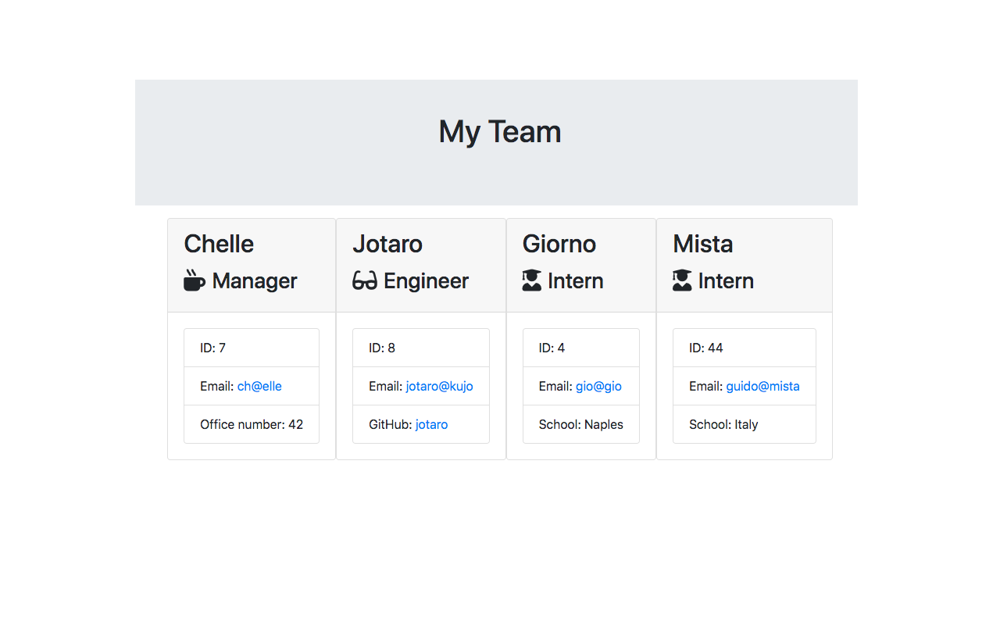

[](https://github.com/maphaiyarath/team-template-generator)

# OOP: Template Engine - Employee Summary


You can watch the walkthrough video [here](./TODO).

## Table of Contents
* [Description](#description)
* [Installation](#installation)
* [Usage](#usage)
* [Credits](#credits)
* [License](#license)
* [Contributing](#contributing)

## Description
This is a software engineering team generator CLI app which prompts the user for information about the team members, from managers, engineers, to interns. When the user has completed building the team, the app will create an HTML file that displays a nicely formatted team roster.

## Installation
Use the following command for installation:
```bash
npm install
```

## Usage
To prompt inquirer, the application will be invoked by running:
```bash
node app.js
```

## Credits
* [Inquirer.js](https://www.npmjs.com/package/inquirer)

## License
This project is licensed under the MIT license.

## Contributing
n/a